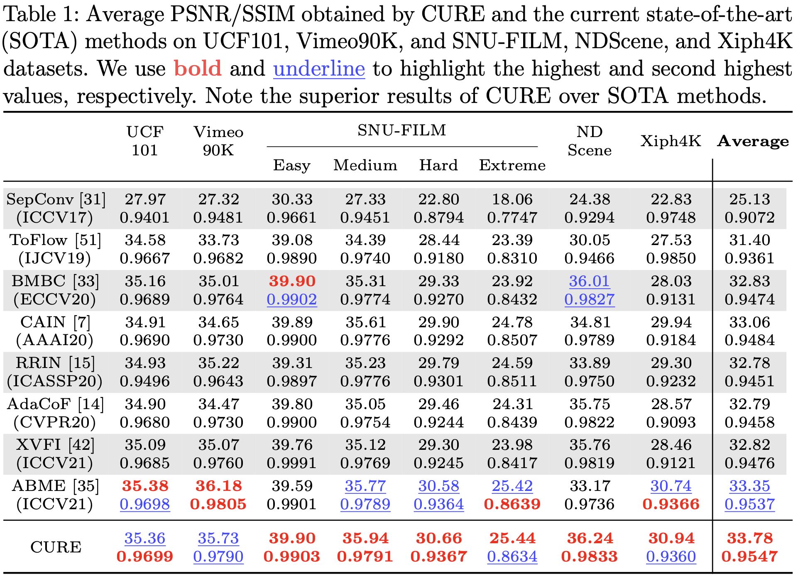

# CURE: Learning Cross-Video Neural Representations for High-Quality Frame Interpolation

#### [Computational Imaging Group (CIG)](https://cigroup.wustl.edu), Washington University in St. Louis

#### Accepted to ECCV 2022 

[Arxiv](https://arxiv.org/abs/2203.00137) | [Project Page](https://www.cse.wustl.edu/~kamilov/projects/2022/cure/) | [video](https://youtu.be/mSV0KsxHT-A)

Official PyTorch Impletement for "Learning Cross-Video Neural Representations for High-Quality Frame Interpolation"

### Requirements and Dependencies 

*Other version of packages might affects the performance 

```
opencv-python==4.5.4.58
torchvision==0.11.1
numpy==1.22.0
scipy==1.7.1
pillow>=9.0.1
tqdm==4.62.3
h5py==3.6.0
pytorch-lightning>=1.5.10
CUDA>=11.3
PyTorch>=1.9.1
CUDNN>=8.0.5
Python==3.8.10
```

###  Installation

Create conda environment 

```
$ conda update -n base -c defaults conda
$ conda create -n CURE python=3.8.10 anaconda
$ conda activate CURE
$ conda install pytorch=1.10.2 torchvision torchaudio cudatoolkit=11.3 -c pytorch
$ pip install -r requirements.txt
```

Download the repository

```
$ git clone https://github.com/WtSg/CURE.git
```

Download the  pre-trained model checkpoint from here: [CURE.pth.tar](https://gowustl-my.sharepoint.com/:u:/g/personal/wentao_shangguan_wustl_edu/Ebar3nGuH-pNkK-_oNJf_4QB8IksM46qurX3YdQLICMrgg?e=c0b1Qv)(Onedrive) or [CURE.pth.tar](https://drive.google.com/file/d/1V4xPAkWYBEwhv7chvYOagbhUWhVSlKlg/view?usp=sharing)(Google Drive) and put the file in the root of the project dir ```CURE```.

### Usage

**Test on a custom frame:** synthesis the intermediate frame between two inputs:

```
$ python test_custom_frames.py -f0 path/to/the/first/frame -f1 path/to/the/second/frame -fo path/to/the/output/frame -t 0.5
```

This will synthesis the middle frame between first frame and second frame. 

Or just run 

```
$ python test_custom_frames.py
```

This will generate the result with the provided sample image. The path of output image  is ```predict.png```.


**Interpolate a custom video**:  

1. Place your custom video in any path 

2. Run the follow command: 

   ```
   $ python intv.py -f 2 -vir /path/to/video -rs 1920,1080 -nf -1 -d 1
   ```

   - -f: the times of original FPS 

   - -vdir: the path to the video 

   - -rs: new resolution (1K resolution needs at least 24GB VMemory)

   - -nf: crop the video and leave numbers of frames from the begging 
   - -d: downsample the video in temporal domain (make FPS lower) 

   The output video will be in the same directory of the input video 
   
   

**Test on datasets:** get quantitative result on evaluating the dataset 

1. Download the dataset and place it in ```CURE/data/``` or you could specify the root dir of dataset with args: ```-dbdir```

   Datasets: 

   - UCF101: [ucf101.zip](https://gowustl-my.sharepoint.com/:u:/g/personal/wentao_shangguan_wustl_edu/ETjyFvy3RuJLovZfDsKl6uQBk_RtQbJ_d4tZWcYReRHvsw?e=k6HdgC)(OneDrive) [ucf101.zip](https://drive.google.com/file/d/1PaPkamYaJ0OYPBp1ab6hCz17cKXL6UgB/view?usp=sharing)(Google Drive)

   - Vimeo90K:[vimeo90k](http://data.csail.mit.edu/tofu/testset/vimeo_interp_test.zip)

   - SNU-FILM: [test](https://www.dropbox.com/s/32wpcpt5izkhoh8/snufilm-test.zip?dl=0),  [eval_modes](https://www.dropbox.com/s/2zmnzsquv5ounvq/eval_modes.zip?dl=0)

   - Nvidia Scene: [nerf_data.zip](https://drive.google.com/drive/folders/1G-NFZKEA8KSWojUKecpJPVoq5XCjBLOV?usp=sharing)

   - Xiph 4K: [Xiph.zip](https://gowustl-my.sharepoint.com/:u:/g/personal/wentao_shangguan_wustl_edu/EfvEIk_hVvBLlQFuJcQ9bC4B9LPHw-0VR9ME4VEF8uBsgQ?e=4NwCaO)(OneDrive) [Xiph.zip](https://drive.google.com/file/d/1luID0epcWGs9mORh82cJaGcZbHJ-gVTy/view?usp=sharing)(Google Drive)

   - X4k: [x4k.zip](https://gowustl-my.sharepoint.com/:u:/g/personal/wentao_shangguan_wustl_edu/ETMZ4u-q-QlCqR7yiSiQCLkBfYc9GPBjEkHUW-VKXAYi5g?e=GOq1WV)(OneDrive) [x4k.zip](https://drive.google.com/file/d/1H9_IcAl2FiRFpd7-TlH8psChM_piDWdv/view?usp=sharing)(Google Drive)

   The data directory should looks like this:

   ```
      CURE
         └── data
             ├──vimeo_triplet
             |	 ├──sequences
             |	 └──tri_testlist.txt
             ├──ucf101
             |  ├──1
             |  ├──...
             ├──Xiph
             |  └──test_4k
             ├──SNU-FILM
             |  ├──eval_modes
             |  |  ├──test-easy.txt
             |  |  ├── ... 
             |  └──test
             |     ├──GOPRO_test
             |     └──YouTube_test
             ├── x4k
             |   ├──test
             |   └──x4k.txt
             ├──  nvidia_data_full
             |   ├──Balloon1-2
             |   ├──Balloon2-2
             |   ├──DynamicFace-2
             └── ├──...
       
       
   ```
   
   

2. Run the following command with args ```-d=/dataset/name```, where dataset name could be any of ```"ucf101", "vimeo90k", "sfeasy", "sfmedium", "sfhard", "sfextreme", "nvidia", "xiph4k", "x4k"```

   For example, when testing Vimeo90K dataset, you should run the following command 

   ```
   $ python test.py -d vimeo90k
   ```

   After compelete, it will print the testing result and generate a txt file named ```result.txt```

### Experiment Results

If environment is proporelly created, you will get the following result. 




### Citation 

```
@misc{shangguan2022learning,
      title={Learning Cross-Video Neural Representations for High-Quality Frame Interpolation}, 
      author={Wentao Shangguan and Yu Sun and Weijie Gan and Ulugbek S. Kamilov},
      year={2022},
      eprint={2203.00137},
      archivePrefix={arXiv},
      primaryClass={eess.IV}
}
```


### Acknowledgment 

RAFT is impleted revised from the official implement: https://github.com/princeton-vl/RAFT

Some of the function was revised from LIIF: https://github.com/yinboc/liif

Pytorch Lightning model: https://www.pytorchlightning.ai

Offical Dataset sources:

​	Vimeo90K: http://toflow.csail.mit.edu

​	SNU-FILM: https://myungsub.github.io/CAIN/

​	UCF101: https://www.crcv.ucf.edu/data/UCF101.php

​	XIPH4k:  https://media.xiph.org/video/derf/.

​	Nvidia Dynamic Scene: https://research.nvidia.com/publication/2020-06_novel-view-synthesis-dynamic-scenes-globally-coherent-depths

​	X4k: https://github.com/JihyongOh/XVFI

  


